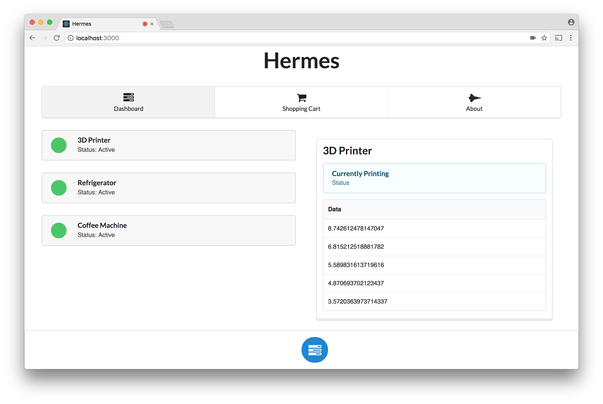
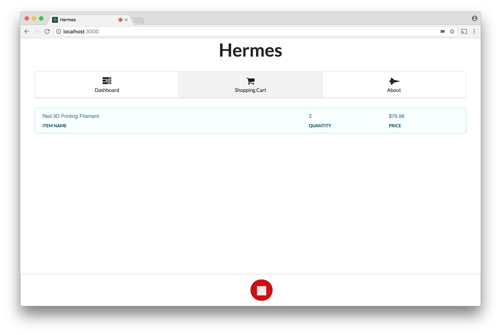
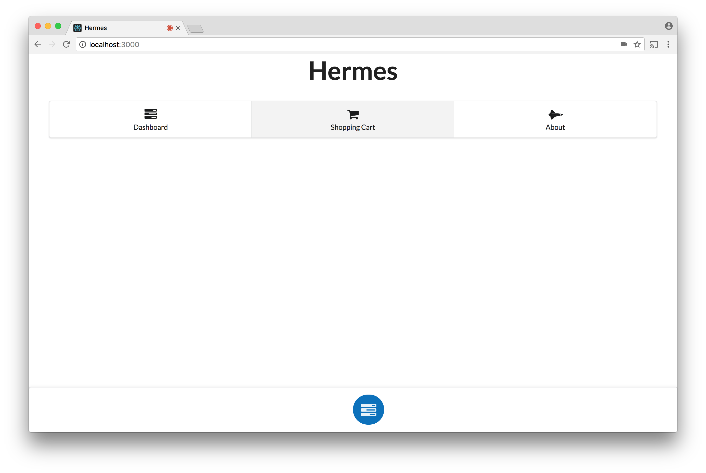

# Hermes

Created by Andre Askarinam, Rami Shahatit & Parsa Attari for DeveloperWeek 2017 Hackathon. This demo won 2nd-place for the Aspera Challenge.

## Description

This is an IoT platform for inventory on devices where devices send inventory data to our platform, which automatically places orders for re-stock on their behalf. This demo is based on an office setting with a 3D printer, refrigerator and a coffee machine.

This incorporates IBM Watson Speech Recognition. Our React-based UI can record commands, send it to our Flask API and then adjust the state of inventory on the back-end side. Speech recognition is hard-coded to understanding two commands: placing coffee in the shopping cart & purchasing all items in the shopping cart.

## Functionality

Here is the view to see IoT devices and their specific properties/live data.



Here is the shopping cart. Note the recording button is active on the bottom (meaning we are recording a voice command). In this case, we are ordering to purchase all items in the cart.



Thus the shopping cart becomes empty.



## Usage

You must run the Flask API and the node app separately (both running by default on different ports). The Flask API requires packages from pip (use virtualenv to install them via pip).

Flask API:
```
$ virtualenv flask-env
$ source flask-env/bin/activate
$ pip install flask
$ pip install flask-cors

$ cd hermes-api/
$ python api.py
* Running on http://127.0.0.1:5000/ (Press CTRL+C to quit)
```

Node App:
```
$ cd hermes-ui/
$ npm start
```


